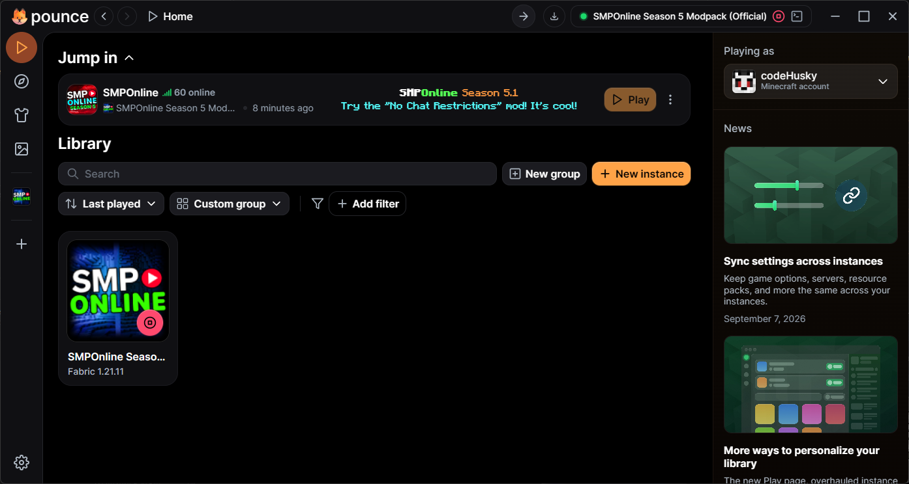

# 🦊 Pounce

Pounce is a fork of the Modrinth App, improving upon it with additional features and capabilities not directly supported in the original app.

The Modrinth App prevents you from doing lots of things it's perfectly capable of. Pounce unlocks those capabilities and extends them for your convenience.

## Changes from Modrinth App

- Allows multiple windows of Minecraft to run from one instance
- Dedicated "launch again" button for already-running instances
- Allows installing new mods in running instances
- Allows enabling disabled mods in running instances
- Ability to change mod loader versions in modpacks still linked to a Modrinth modpack
- Removed auto-updater (may be replaced with an update nag)
